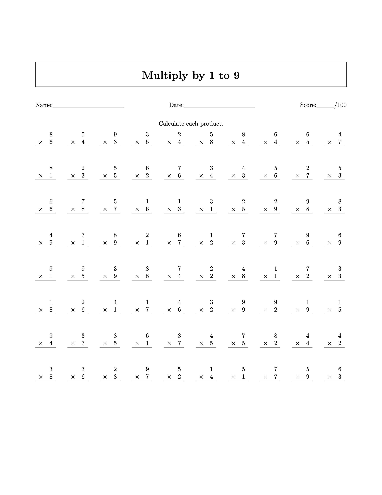

## Mathematics Worksheet generator

### Install requirements

[Install MacTex](https://tug.org/mactex/)

    python3 -m venv venv
    source venv/bin/activate
    pip install -r requirements.txt

### Generate a random PDF

To generate 5 random multiplication worksheets

    ./worksheet-generator.py --type multiplication --count 5

Or one division worksheet

    ./worksheet-generator.py --type division

Types also include `addition` and `subtraction`

