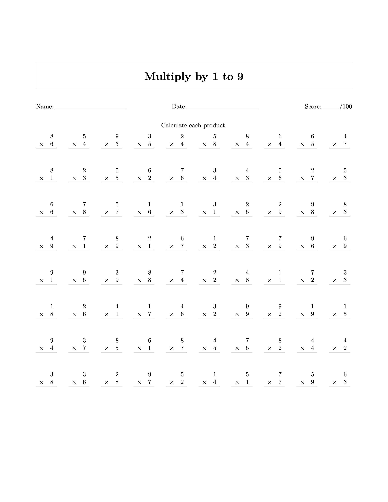
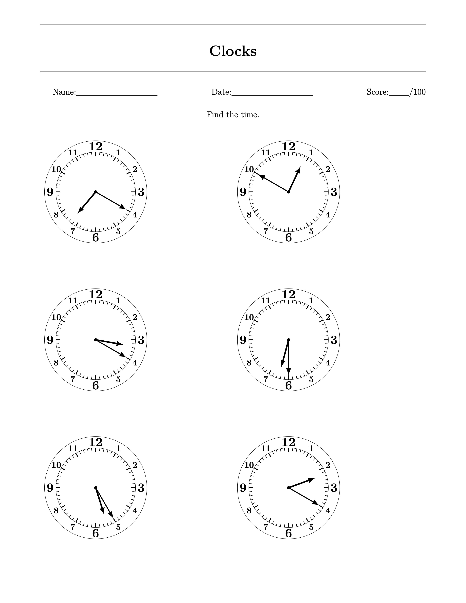
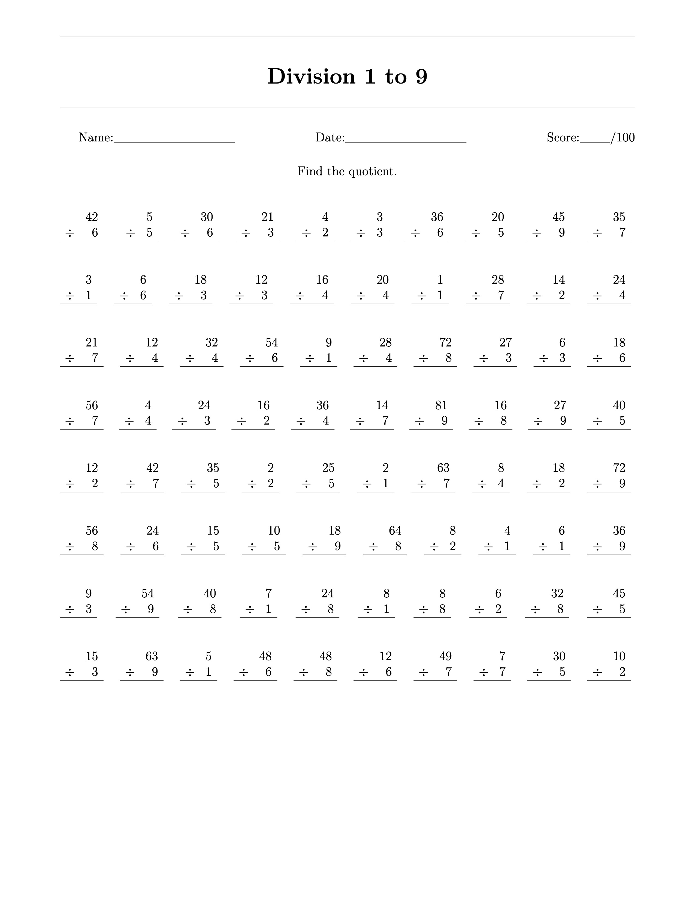
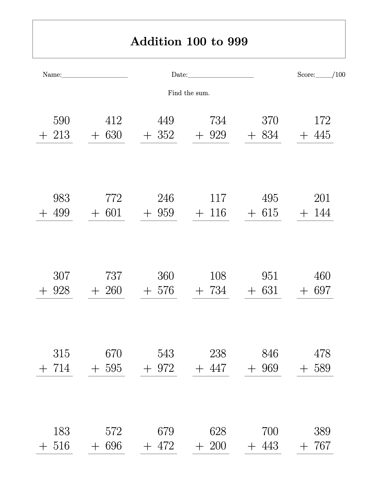
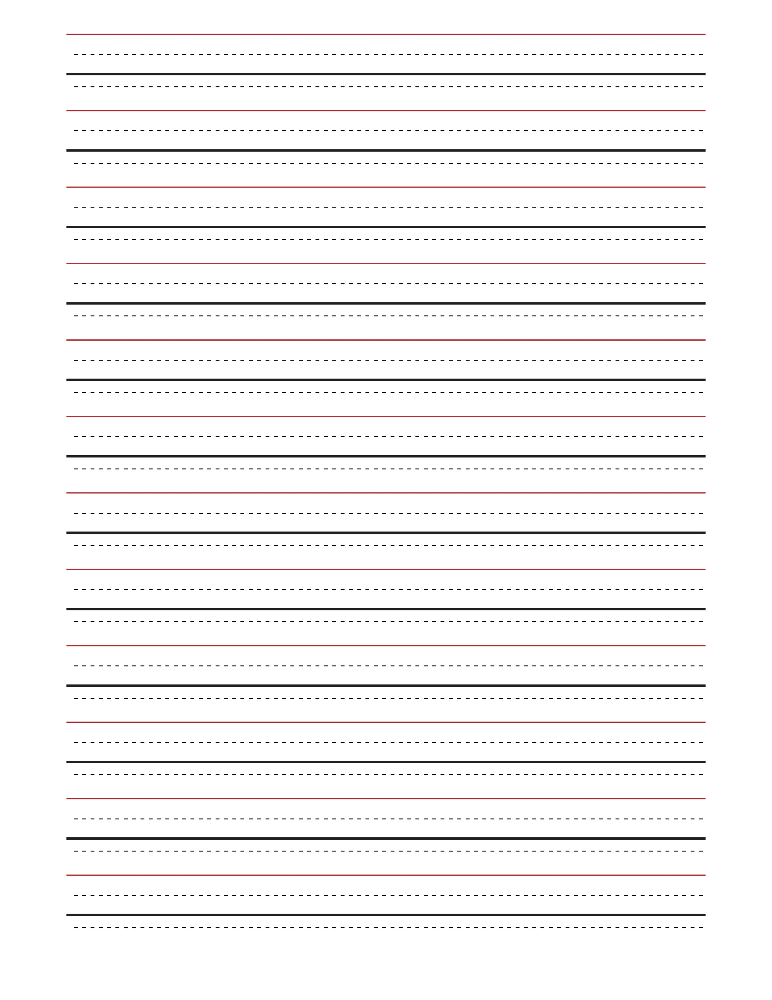

## Mathematics Worksheet generator

I'm a firm believe in practice makes perfect and because the richest nation in the world cannot or will not afford books and printed worksheets I had to cobble something together for generating some basic worksheets. The most important worksheet and original motivation was the multiplication and division worksheets to create that automatic knowledge upon which more interesting concepts are built, but we've expanded into clock reading and long addition as it came up.

The worksheets are random so as to avoid simple copying.

Oh, and could I have downloaded these off the web? Sure, to a limited extent. However, I have no interest in paying for these sorts of materials, registering for a website or limiting myself to the one free one. I wanted to be able to print new problems every day without having to go searching the web for 15 minutes. In fact, I can print them off on Sunday for the week, giving myself a variety of options.

### Contributions

This is just a quick hack to meet the day-to-day needs of my child's education. If you make it better, more flexible or add something that is missing feel free to fork, and send me a pull-request.

### Install requirements

[Install MacTex](https://tug.org/mactex/)

    python3 -m venv venv
    source venv/bin/activate
    pip install -r requirements.txt

### Generate a random PDF

To generate 5 random multiplication worksheets

    ./worksheet-generator.py --type multiplication --count 5

Or one division worksheet

    ./worksheet-generator.py --type division

Types also include `addition`, `subtraction` and `clocks`

The ruled writing paper is probably not important to generate unless 
you want to adjust the sizes.

### Multiplication

### Clocks

### Division

### Addition

### Ruled A4 Paper

